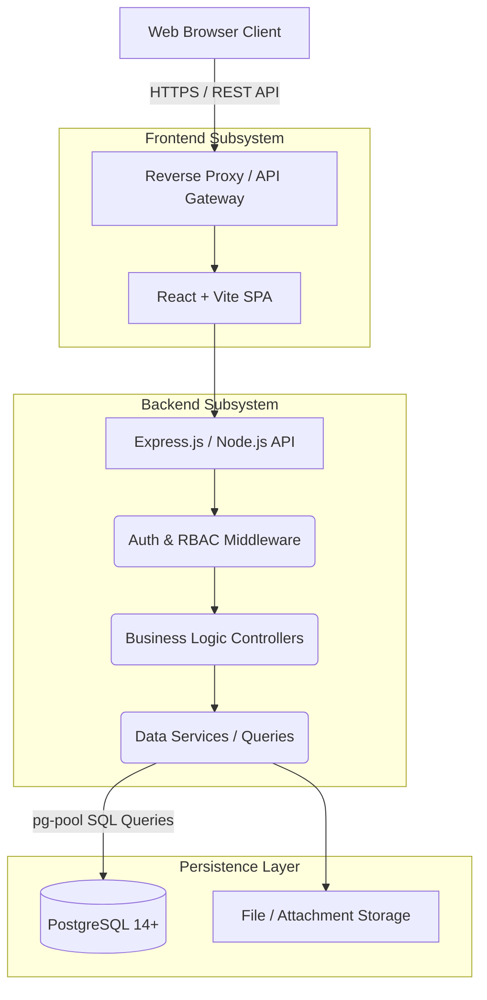
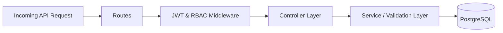
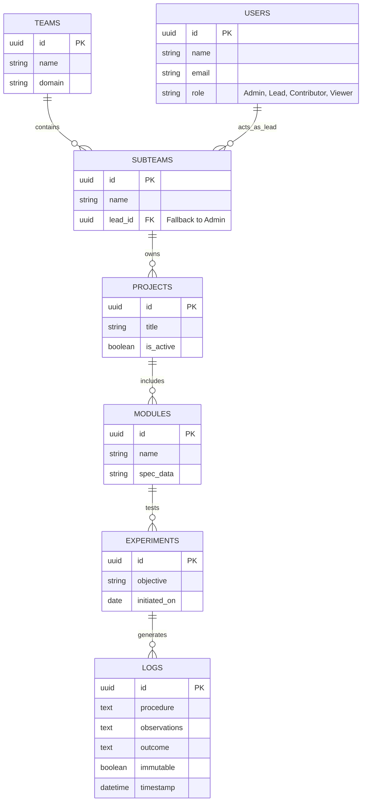

# LabLedger: System Architecture & System Design Document

## 1. Architectural Overview

LabLedger utilizes a modern, modular **3-tier architecture** comprising a presentation layer natively rendered in the browser, a stateless API layer, and a robust data persistence layer. The entire software stack is fully containerized, ensuring zero-configuration deployments and identical development/production parity through `docker-compose`.

---

## 2. Technology Stack

- **Frontend:** React (JSX), Vite (bundler), Tailwind CSS (styling context), Context API (state management).
- **Backend:** Node.js, Express.js.
- **Database:** PostgreSQL (with `pg` node-postgres connector).
- **Authentication:** JSON Web Tokens (JWT) & bcrypt for password hashing.
- **Deployment:** Docker & Docker Compose.

---

## 3. Frontend Architecture

The frontend is implemented as a Single Page Application (SPA). It uses a contextual design where component states depend heavily on the injected user role.

### 3.1 Organization
- `src/api`: Centralized Axios/fetch wrappers mapping to backend endpoints, isolating API logic from UI.
- `src/components`: Reusable UI modules (Cards, Modals, Buttons) following a structured design token system.
- `src/context`: React Context providers holding global application state, most notably the **AuthContext** mapping the runtime session and permissions.
- `src/hooks`: Custom React hooks abstracting complex multi-API behaviors and subscription logic.
- `src/pages`: Distinct topological views mapped to React Router entries (e.g., Dashboard, Admin Panel, Experiment View).

### 3.2 Dynamic Contextual Rendering
The routing and components dynamically hide or show based on the user's encoded JWT role:
- **Admin Users:** See full routing including `Registration Queue` and `Subteam Management`.
- **Viewers:** The UI strips all `PUT`/`POST`/`DELETE` triggers from the virtual DOM.
- **Leads:** Trigger specialized dashboard clusters managing their specifically assigned Subteams.

---

## 4. Backend System Design

The Express backend strictly adheres to a controller-service separation, guaranteeing that routing layers do not leak business logic.

### 4.1 Layer Definitions
1. **Routes (`/src/routes`):** Defines RESTful endpoints, applying scoped middleware based on resource clearance.
2. **Middleware (`/src/middleware/authHandler`):** Validates the bearer token, parses the user claim, and checks horizontal/vertical permissions against the target route.
3. **Controllers (`/src/controllers`):** Receives validated requests, processes complex orchestrations, and formats standard HTTP responses.
4. **Scripts/Services:** Standalone logic encapsulating DB transactions, seed procedures, and password validation.

### 4.2 Security & Rate Limiting (Logical)
The application fundamentally enforces backend guarding. Even if a 'Viewer' constructs a POST payload from a developer console, the API pipeline structurally rejects it before controller invocation.

---

## 5. Database Schema & Entity-Relationship Design 

The relational database ensures maximum structural integrity, leaning on strict `ON DELETE CASCADE / SET NULL` protocols ensuring orphaned entities do not exist.

---

## 6. Core System Flows

### 6.1 Ownership Fallback Mechanism
A core mechanism for data integrity is resolving leadership when an account is deleted or downgraded.
1. **Trigger:** An Admin deletes user `user_X` (who is a Subteam Lead).
2. **Intervention:** A backend service triggers pre-deletion.
3. **Resolution:** The DB searches for a target active Admin. The system surgically updates `Subteams.lead_id` mapped to `user_X` to point to `admin_user_id`.
4. **Conclusion:** Data consistency preserved; `user_X` deleted.

### 6.2 Data Immutability for Scientific Logs
LabLedger prioritizes capturing accurate historical empirical data.
- **Standard CRUD:** Projects and Modules accept typical CREATE/READ/UPDATE/DELETE.
- **Log Append-Only Model:** `Logs` act asynchronously. The API exposes `POST /logs` but explicitly omits `PUT /logs` and `DELETE /logs`. Once a physical experiment event is registered to the database, its block becomes cryptographically static in context of the application interface.

## 7. Containerization & Deployment
The deployment model relies on a single isolated environment:
- **`app` container:** Builds Vite assets internally; runs node instance on mapping port.
- **`db` container:** Standard Postgres image with pre-allocated volumes mapping `init-scripts` to build the required relational tables automatically upon first launch.
